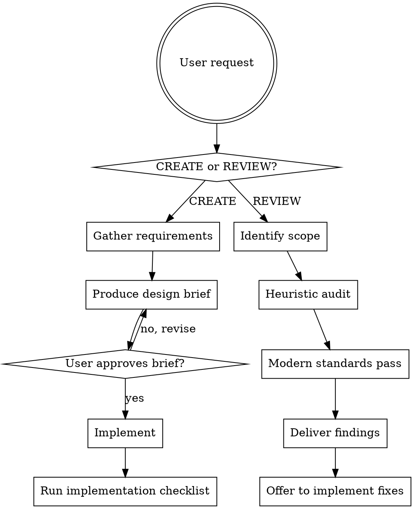

# UI/UX Design

## Overview
Two-path skill: **CREATE** new interfaces through design brief approval then implementation, or **REVIEW** existing interfaces against usability heuristics and modern web standards.

**Core principles:**
- No code before design brief is approved (CREATE path)
- No completion claim without running the implementation checklist
- Always real content — no lorem ipsum, no placeholder images

<HARD-GATE>
On the CREATE path: do NOT write any HTML, CSS, or JS until the design brief has been presented and the user has explicitly approved it.
</HARD-GATE>

## Decision Flow



---

## CREATE Path

### Step 1: Gather Requirements
Ask questions **one at a time**. Cover:
1. **What** — what page/feature/component are we building?
2. **Who** — who is the primary user? What are they trying to accomplish?
3. **Brand feel** — pick 2-3 adjectives: _professional_, _playful_, _minimal_, _bold_, _warm_, _techy_…
4. **Constraints** — existing framework/stack? Existing design system? Accessibility requirements?

Only ask what you don't already know from context. Skip questions with obvious answers.

### Step 2: Produce Design Brief
Use template at `design-brief-template.md`. Present **section by section**, not all at once:
- Visual Direction first (palette + typography)
- Layout & Components second
- Interaction & Motion third

Ask "Does this direction look right?" after each section.

### Step 3: Implement
Once brief is approved:
- Use CSS custom properties (design tokens) for all color/spacing/typography values
- Use a Google Font (Inter, Outfit, Roboto, Plus Jakarta Sans, etc.)
- Use semantic HTML elements (`nav`, `main`, `section`, `article`, `button`)
- Build mobile-first with defined breakpoints
- Add micro-animations (150–400ms transitions on interactive elements)
- Handle loading, empty, and error states
- Generate real images with `generate_image` tool if needed — never use placeholders

### Step 4: Run Implementation Checklist
See `implementation-checklist.md`. Run every item before claiming done.

---

## REVIEW Path

### Step 1: Identify Scope
Ask: full application, specific page, or specific component?

If reviewing code: read the relevant files first.
If reviewing a screenshot: ask the user to describe it or share it.

### Step 2: Heuristic Audit
Evaluate against Nielsen's 10 heuristics (see `design-principles.md`).

For each heuristic, score: `✅ Pass` / `⚠️ Partial` / `❌ Fail`

Only report heuristics with findings (skip clean passes unless explicitly asked for a full report).

### Step 3: Modern Web Standards Pass
Check:
- Visual hierarchy and color usage (curated palette vs generic colors?)
- Typography (custom font vs browser default?)
- Responsiveness (tested mentally at 375px, 768px, 1280px)
- Interactive states (hover, focus, active defined?)
- Motion (micro-animations present? Appropriate speed?)
- Dark mode support (if applicable)
- Accessibility: contrast ratio, keyboard navigation, ARIA labels

### Step 4: Deliver Findings

Format:
```
### Critical (must fix — broken UX or accessibility)
[Issue] — [why it matters] — [specific fix]

### Important (significant improvement)
[Issue] — [why it matters] — [specific fix]

### Minor (polish)
[Issue] — [suggestion]
```

Reference specific file names and line numbers where possible.

### Step 5: Offer to Implement
```
Found [N] issues. Would you like me to implement the Critical and Important fixes now?
```

If yes: implement fixes, then run implementation checklist on changed areas.

---

## Key Principles

**YAGNI for UI** — Don't add components, pages, animations, or states that weren't asked for.

**No lorem ipsum** — Use real, representative content. If you don't have it, ask the user or invent realistic placeholder text (e.g. "Sarah Chen — Product Designer").

**Tokens over magic numbers** — Every color, spacing, and font size should be a CSS variable. No `#3b82f6` inline in HTML.

**One question at a time** — During requirements gathering, never ask more than one question per message.

## Integration

| Situation | Skill sequence |
|-----------|---------------|
| New feature from scratch | `brainstorming` → `ui-ux-design` → `writing-plans` |
| Quick UI task (clear requirements) | `ui-ux-design` directly |
| Reviewing existing UI | `ui-ux-design` (REVIEW path) |
| Implementation plan already exists | `writing-plans` → `executing-plans` |

## Reference Files
- `design-principles.md` — Nielsen's 10 heuristics + WCAG checklist (read when running REVIEW audit)
- `design-brief-template.md` — Brief template (read when producing brief on CREATE path)
- `implementation-checklist.md` — Completion checklist (read before declaring done)
